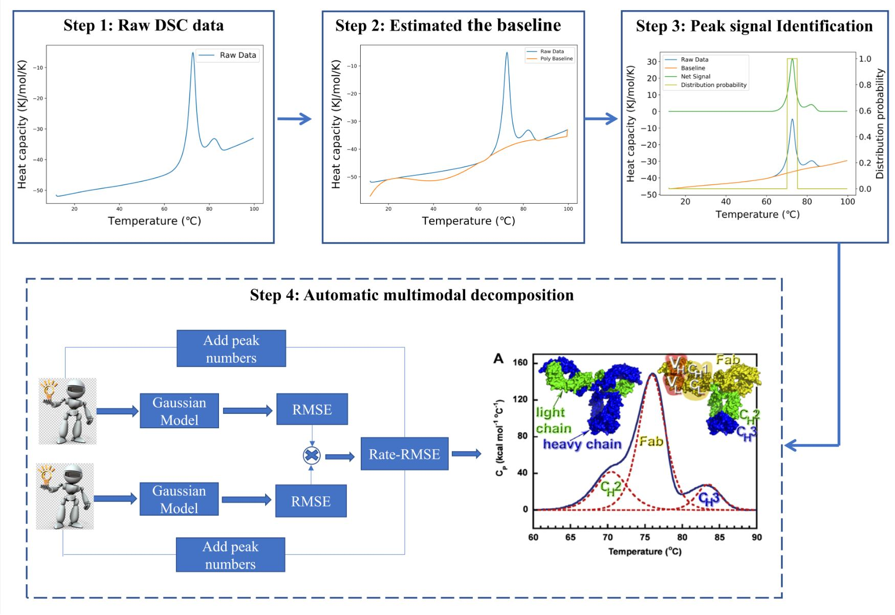

# DSC_analysis_peak_separation

This is our code implementation for DSC peak separation. Any commercial usage should go through the author's permission.

* In this study, we proposed a fully automated method for analyzing differential scanning calorimetry (DSC) data. The overlapping peak separation is based on reinforcement learning. 
* We create an agent to replace people to interact with the environment and then learn from the collected state sequence without prior training. We use the Monte Carlo method to evaluate the value of peak separation and improve the deconvolution strategy. 
* We use two types of large proteins to verify the effectiveness of this method. Our automated analysis method can improve the efficiency and accuracy of DSC signal analysis.
Our automated DSC data analysis methods could potentially lead to higher throughput in the high volume drug screening process.

